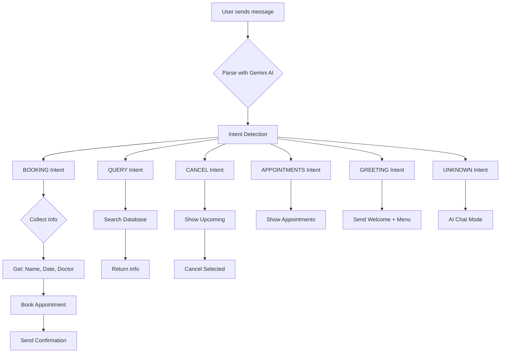

# WhatsApp Bot AI Improvement Plan

## Current System Analysis

### What's Working:
- ✅ Webhook receiving messages from WATI
- ✅ Session-based conversation management
- ✅ Keyword-based routing (hi, 1, 2, 3, 4, 5)
- ✅ Menu flow with options
- ✅ Booking flow with steps
- ✅ AI fallback using Gemini for general questions
- ✅ WhatsApp messages being delivered

### Issues to Fix:
- ❌ Users must remember specific commands (1, 2, 3, etc.)
- ❌ AI fallback only triggers for unrecognized messages
- ❌ No intelligent intent detection
- ❌ Complex booking flow requires multiple steps
- ❌ No natural language understanding

---

## Proposed Hybrid AI System

### Vision: Make the bot smart and easy to use

The goal is to create a **conversational AI assistant** that:
1. **Understands natural language** - Users can type anything
2. **Intelligently routes** - AI determines the intent
3. **Simplifies booking** - Less steps, more intuitive
4. **Handles exceptions gracefully** - Falls back to human when needed

### Flow Diagram



---

## Implementation Plan

### Phase 1: AI Intent Detection

**Add to `AiService`:**
```typescript
interface IntentResult {
  intent: 'booking' | 'query' | 'cancel' | 'appointments' | 'greeting' | 'help' | 'unknown';
  entities: {
    patientName?: string;
    date?: string;
    doctor?: string;
    phone?: string;
  };
  confidence: number;
  response: string;
}
```

**System Prompt Enhancement:**
- Add intent classification rules
- Extract entities from natural language
- Handle variations (e.g., "I want to come in Tuesday" → booking intent, date: Tuesday)

### Phase 2: Simplified Booking Flow

**Current Flow (Complex):**
```
User: book
Bot: What name?
User: John
Bot: What date?
User: tomorrow
Bot: Which doctor?
User: 1
Bot: Which time?
User: 10am
Bot: Confirm?
User: yes
```

**Proposed Flow (Simple):**
```
User: I want to book appointment for tomorrow 10am with Dr. Smith
Bot: Confirming: Appointment tomorrow at 10am with Dr. Smith for John. Is this correct?
User: yes
Bot: ✅ Booked! Confirmation sent to your email.
```

**Natural Language Examples:**
| User Input | Detected Intent | Extracted Entities |
|------------|-----------------|---------------------|
| "I need a checkup" | booking | type: checkup |
| "Book for tomorrow" | booking | date: tomorrow |
| "When is my appointment?" | appointments | - |
| "Cancel my booking" | cancel | - |
| "What are your hours?" | query | entity: hours |
| "Hi there" | greeting | - |

### Phase 3: Enhanced Context Awareness

**Store in session context:**
- Previous conversation history
- Last mentioned patient name
- Recent appointments
- Pending actions

### Phase 4: Smart Fallback

**When AI is uncertain:**
1. Show quick reply buttons for common actions
2. Ask clarifying questions
3. Escalate to human agent if needed

---

## Code Changes Required

### 1. Update `AiService`

```typescript
// New method: intent detection
async detectIntent(
  message: string,
  tenantId: string,
  sessionContext: Record<string, any>
): Promise<IntentResult>

// Enhanced generateReply with context
async generateReply(
  tenantId: string,
  patientMessage: string,
  sessionContext: Record<string, any>,
  intent?: IntentResult // NEW: pass detected intent
): Promise<string>
```

### 2. Update `WhatsappService.processMessage()`

```typescript
// Modified flow:
async processMessage(from, text, phoneNumberId) {
  // 1. Load session
  // 2. If IDLE state: Use AI for intent detection
  // 3. Route based on intent (not just keywords)
  // 4. If booking intent with all info: Direct book
  // 5. If booking intent with partial info: Collect missing
  // 6. If query/help: Use AI chat mode
}
```

### 3. Update `whatsapp-session.schema.ts`

```typescript
// Add new states for hybrid flow
export enum SessionState {
  IDLE = 'IDLE',
  AI_CHAT = 'AI_CHAT',           // Conversational mode
  BOOKING_SIMPLE = 'BOOKING_SIMPLE', // Simplified booking
  // ... existing states
}
```

### 4. Add Smart Quick Replies

When user sends something unclear:
```
🤔 I can help you with:
📅 Book an appointment
📋 View my appointments
❌ Cancel an appointment
💬 Ask a question
```

---

## Detailed Task List

- [ ] **Task 1**: Enhance `AiService` with intent detection
  - Add `detectIntent()` method
  - Create system prompt for classification
  - Extract entities (date, doctor, patient name)
  
- [ ] **Task 2**: Update `WhatsappService` to use AI routing
  - Replace keyword-only matching with AI intent detection
  - Add fallback to AI chat for queries
  
- [ ] **Task 3**: Simplify booking flow
  - Allow single-message booking with all details
  - Parse natural language dates
  - Auto-detect doctor preference

- [ ] **Task 4**: Add quick reply buttons (optional)
  - Show common options for unclear messages
  - Make UI more interactive

- [ ] **Task 5**: Testing & Refinement
  - Test various natural language inputs
  - Improve intent detection accuracy
  - Add more entity extraction patterns

---

## Benefits

| Feature | Before | After |
|---------|--------|-------|
| Booking | 6+ steps | 1-2 steps |
| Queries | Not supported | AI powered |
| Language | Fixed keywords | Natural language |
| Routing | Hardcoded keywords | AI intelligent |
| User experience | Rigid | Conversational |

---

## Next Steps

1. **Approve this plan** 
2. **Start with Task 1**: Implement AI intent detection in `AiService`
3. **Test with sample messages**
4. **Iterate and improve**

---

## Notes

- Gemini API is already configured (GEMINI_API_KEY in .env)
- Session management already in place
- WATI integration working
- Need to balance AI usage with API costs (use 1.5 Flash for intent detection)
